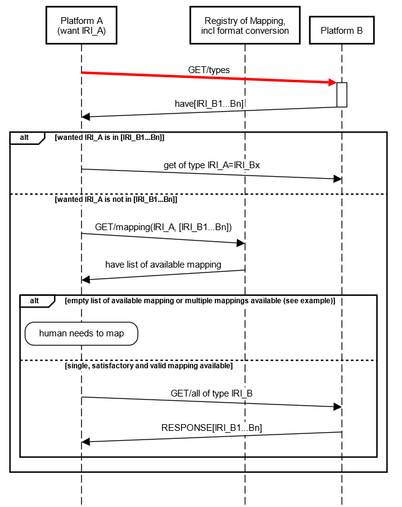
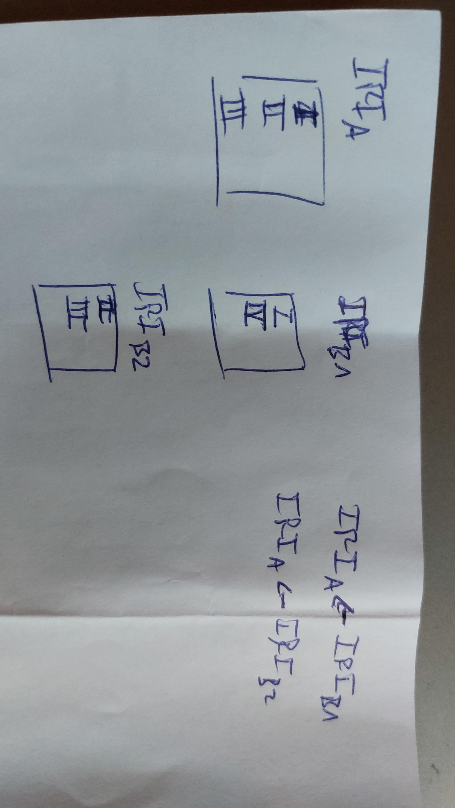
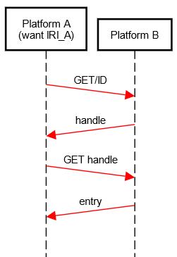

Platform A and B are any ORD/RDM platforms, e.g. workflow managers, ELNs etc.
A registry is used to gather all existing mappings between schemas identified by IRIs

In case multiple mappings are present, a human has to intervene, because of the following problem:

Diagram 2: Example case for multiple possible mappings.

## endpoints

The minimal communication between platforms can be reduced to six endpoints.

- GET/types
- GET/oftype/{type} --> maybe response {type=ma:PlatformTypesSet}
- GET/{id}
- POST/entry
- POST/entries
- GET/responseto/{handle}

**For HTTP content type "handle":**

In the header of the HTTP request, the HTTP content type (of type mime type) is used to specify the expected respose to trigger the asynchronous communication through handles (see diagram 3) or through the synchronous file exchange (.eln format). If a handle is expected, content type is application/json, else if eln-file-format is expect, content type is application/zip. Also both content types can be specified in combination.

Each handle based reqest includes the following processes:

